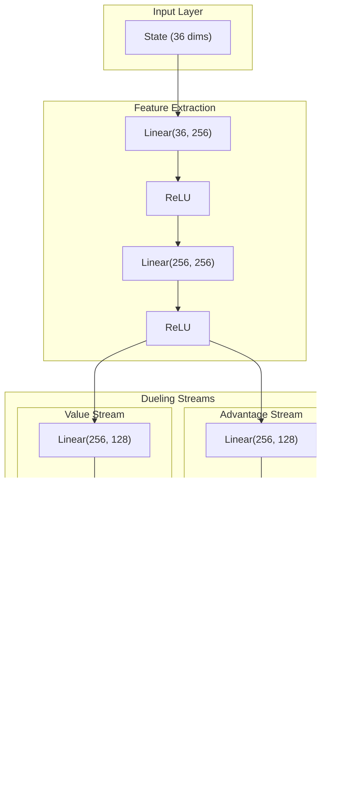

# Spacewar! AI - Architecture and Engineering Documentation

This document explains how Spacewar! AI works at a systems level. It's intended for developers who want to modify the codebase, understand design decisions, or debug training issues. For usage instructions, see the README. For development history and lessons learned, see VIBE_HISTORY.md.

The diagrams use Mermaid syntax and render in GitHub, VS Code, and most modern documentation viewers.

## Table of Contents

1. [Project Philosophy](#project-philosophy)
2. [System Overview](#system-overview)
3. [Component Architecture](#component-architecture)
4. [Environment Design](#environment-design)
5. [Agent Architecture](#agent-architecture)
6. [Training Pipeline](#training-pipeline)
7. [LLM Integration](#llm-integration)
8. [Reward System Design](#reward-system-design)
9. [Self-Play and League Training](#self-play-and-league-training)
10. [Configuration Management](#configuration-management)
11. [Data Flow](#data-flow)
12. [Deployment Considerations](#deployment-considerations)
13. [Troubleshooting Guide](#troubleshooting-guide)
14. [Future Roadmap](#future-roadmap)

---

## Project Philosophy

### Core Principles

**1. Simplicity Over Complexity**

The codebase deliberately avoids over-engineering. With ~4,000 lines across 6 modules, it remains comprehensible to a single developer. We reject:
- Premature abstraction (no factory-of-factory patterns)
- Deep directory nesting (flat structure)
- Configuration-driven-everything (sensible defaults)

**2. Real Implementations Over Stubs**

Every function does real work. No placeholder implementations, no `pass` statements, no `return None` without justification. This prevents the "it compiles but does nothing" antipattern common in AI projects.

**3. Training-Time LLM, Not Runtime**

LLMs have 200-2000ms latency. Games run at 50 FPS (20ms frames). These are fundamentally incompatible for real-time decisions. LLMs are used for:
- Exploration guidance during training
- Strategy generation (offline)
- Iterative refinement based on performance feedback

**4. Efficiency as a First-Class Reward**

Winning isn't enough - agents should win efficiently. This produces more transferable strategies and avoids degenerate "spam everything" tactics.

### Design Decisions Summary

| Decision | Rationale |
|----------|-----------|
| Flat file structure | 6 files are easier to navigate than 30 |
| Dataclass configs | Type-safe, IDE-friendly, serializable |
| PyTorch over TensorFlow | Better debugging, cleaner API |
| Gymnasium over custom env | Standard interface, tool compatibility |
| Action masking via logits | Differentiable, clean, no post-hoc rejection |
| PPO over A3C/IMPALA | Single-machine focus, simpler debugging |

---

## System Overview

### Why This Architecture?

The Spacewar! AI system faces a fundamental tension: reinforcement learning requires millions of environment interactions, but modern LLMs that could provide strategic guidance have latencies 100x slower than game frames. Our architecture resolves this by treating LLMs as training-time oracles rather than runtime decision-makers.

The system is organized into three logical tiers:

1. **Orchestration Layer** (`main.py`): Manages the training lifecycle, including episode loops, checkpointing, and mode selection (training, evaluation, tournament, iterative refinement).

2. **Learning Layer** (`agents.py`, `llm_integration.py`): Contains the actual learning algorithms (DQN, PPO) and optional LLM guidance for exploration or strategy generation.

3. **Simulation Layer** (`environment.py`): A faithful recreation of the 1962 Spacewar! physics, exposing a standard Gymnasium interface that decouples game mechanics from learning algorithms.

This separation means you can swap PPO for DQN without touching the environment, or replace the LLM provider without modifying the training loop. Each layer has a single responsibility and clear interfaces.

### High-Level Architecture


**Description**: The system follows a layered architecture with clear separation of concerns. The CLI parses arguments and instantiates the appropriate trainer, which orchestrates the environment, agents, and optional LLM integration. All state is persisted through checkpoints and logs.

### Module Dependency Graph


**Description**: Dependencies flow from configuration outward. `config.py` has no dependencies and is imported by all other modules. `main.py` is the integration point that brings everything together.

---

## Component Architecture

### The Module Philosophy

Each module in Spacewar! AI follows a "single owner" principle: one module owns each concept, and other modules import from it. This prevents the circular dependency nightmares common in ML codebases where "just one more import" creates spaghetti.

The modules are ordered by abstraction level:
- `config.py` - Pure data, no logic
- `environment.py` - Game simulation, no ML
- `agents.py` - Learning algorithms, no game knowledge
- `llm_integration.py` - External API handling, no training logic
- `tournament.py` - Competition framework, uses agents as black boxes
- `main.py` - Glue code only, all logic lives in other modules

This ordering means you can understand each module without understanding the ones below it in the import chain. A developer debugging PPO doesn't need to understand the tournament system.

### Module Responsibilities

#### config.py (Configuration Layer)

**Purpose**: Single source of truth for all hyperparameters and settings.

**Design Pattern**: Dataclass composition with nested configuration objects.


**Philosophy**: Configuration should be:
- Type-safe (dataclasses provide this)
- Centralized (one file, one import)
- Hierarchical (group related settings)
- Validated (post_init checks)

#### environment.py (Game Engine)

**Purpose**: Faithful recreation of Spacewar! physics as a Gymnasium environment.

**Historical Context**: The original Spacewar! (1962) ran on a PDP-1 with 9KB of memory. Its physics - inverse-square gravity, Newtonian momentum, toroidal screen wrap - were revolutionary for the time and remain compelling gameplay elements. Our implementation preserves these mechanics while exposing them through the modern Gymnasium API.

**Why Gymnasium?**: Gymnasium (formerly OpenAI Gym) is the standard interface for RL environments. Using it means our agents work with any Gymnasium-compatible algorithm implementation, and our environment works with any Gymnasium-compatible agent. This interoperability is worth the minor overhead of conforming to the API.

**Key Components**:


**Physics Model**:


**Description**: Each physics step applies Newtonian mechanics with inverse-square gravity from the central star. The screen wraps toroidally, meaning objects leaving one edge appear on the opposite side.

**The Gravity Challenge**: Inverse-square gravity creates emergent complexity. Ships can:
- Orbit the star (stable but predictable)
- Slingshot around it (efficient but risky)
- Hide behind it (defensive but passive)

This makes the state space much richer than a simple arena shooter. Agents must learn orbital mechanics implicitly through experience, creating natural curriculum: early random exploration teaches "don't hit the star," later refinement teaches "use gravity for acceleration."

**Toroidal Wrap Trade-offs**: Screen wrapping means there's no "corner" to trap opponents in, and distances wrap around edges. This prevents degenerate "run away forever" strategies but complicates distance calculations for the observation space.

#### agents.py (Learning Algorithms)

**Purpose**: Implement DQN and PPO agents with a shared interface.

**Why Two Algorithms?**: DQN and PPO represent fundamentally different approaches to RL:

- **DQN** (Deep Q-Network) learns a value function Q(s,a) that estimates future rewards for each action. It's off-policy, meaning it can learn from old experiences stored in a replay buffer. This makes it sample-efficient but potentially unstable.

- **PPO** (Proximal Policy Optimization) directly learns a policy pi(a|s) that maps states to action probabilities. It's on-policy, meaning it discards experiences after each update. This makes it less sample-efficient but more stable.

For Spacewar!, both have merits: DQN's replay buffer helps with the sparse reward signal (kills are rare), while PPO's stability helps with the complex action dynamics (thrust, rotation, firing). We implement both to allow experimentation.


**Algorithm Comparison**:

| Aspect | DQN | PPO |
|--------|-----|-----|
| Learning Type | Off-policy | On-policy |
| Sample Efficiency | Higher (replay buffer) | Lower (discard after use) |
| Stability | Target network helps | Clipping helps |
| Action Space | Discrete only | Discrete or continuous |
| Batch Timing | Every step (after warmup) | Every n_steps |
| Memory Usage | High (replay buffer) | Lower (rollout only) |

**Choosing Between Them**: Start with PPO for initial experiments - it's more forgiving of hyperparameter choices. Switch to DQN if you need faster iteration (its replay buffer means each environment step is used multiple times) or if you're running on memory-constrained hardware and can't afford PPO's batch accumulation.

---

## Environment Design

### The Observation Design Problem

Designing the observation space is one of the most consequential decisions in RL. Give the agent too little information and it can't solve the task. Give it too much and learning becomes slow or impossible (curse of dimensionality). Give it the wrong representation and the agent learns spurious correlations.

For Spacewar!, we faced specific challenges:
1. **Symmetry**: The game is symmetric, but absolute coordinates aren't. Ship at (100,100) vs (700,500) should be equivalent.
2. **Angles**: Ship heading wraps from 359 to 0 degrees, creating a discontinuity.
3. **Variable entities**: The number of active torpedoes changes during gameplay.
4. **Opponent modeling**: The agent needs to predict opponent behavior without explicit access to opponent's internal state.

### Observation Space

The agent observes a 36-dimensional normalized vector:


**Design Rationale**:

1. **Relative positions**: Agent learns relative spatial reasoning, not absolute coordinates
2. **Sin/cos for angles**: Continuous representation avoids discontinuity at 0/360 degrees
3. **Normalized values**: All inputs in [-1, 1] or [0, 1] for stable gradients
4. **Action mask in observation**: Agent can learn to condition on valid actions

### Action Space


**Action Masking Implementation**:

```python
# In policy forward pass:
logits = network(state)
logits[invalid_actions] = -inf  # Before softmax
probs = softmax(logits)  # Invalid actions get prob=0
```

This is cleaner than post-hoc rejection and maintains differentiability.

---

## Agent Architecture

### DQN Architecture



**Dueling Architecture Rationale**:

The dueling architecture separates state value V(s) from action advantages A(s,a). This helps when:
- Many states have similar values regardless of action
- The agent needs to learn "this state is good/bad" before "which action is best"

### PPO Architecture


**PPO Update Algorithm**:


**Critical: Batch Accumulation**

PPO must accumulate `n_steps` (default 2048) before updating. Per-episode updates cause:
- High variance advantage estimates
- Unstable policy updates
- Failed learning

---

## Training Pipeline

### Understanding the Training Modes

Spacewar! AI supports multiple modes for training, evaluation, and play:

| Mode | Command | Purpose | When to Use |
|------|---------|---------|-------------|
| Standard | `--algorithm ppo` | Basic self-play training | First experiments, baseline |
| Iterative | `--iterative` | LLM generates and refines strategies | When you have LLM access and want faster convergence |
| Champion | `--champion-train` | Train against best past models | After initial training, to harden the policy |
| Tournament | `--tournament` | Evaluate multiple models | Comparing different training runs |
| Human Play | `--human-play --difficulty X` | Play against AI yourself | Testing agents, having fun |

The training modes build on each other: start with standard training to establish a baseline, use iterative training to bootstrap with LLM knowledge, then use champion training to refine against the best opponents.

**Human Play Difficulty Levels:**

| Difficulty | AI Behavior |
|------------|-------------|
| easy | Heuristic AI with slow reactions (3 frame delay) |
| medium | Trained model with randomness (2 frame delay) |
| hard | Best model, deterministic (1 frame delay) |
| insane | Best model, no delays, instant reactions |

### Main Training Loop


### Iterative Strategy Training


---

## LLM Integration

### The LLM Dilemma

LLMs can provide strategic reasoning that's difficult to learn from scratch through RL. They can articulate concepts like "lead your shots" or "use gravity assists" that would take millions of episodes to discover through random exploration. But they're slow - 200-2000ms per API call versus 20ms per game frame.

We resolve this dilemma through three integration modes:

1. **Exploration Guidance** (`LLMExplorationGuide`): During training, occasionally replace random exploration with LLM-suggested actions. The agent still learns from the outcomes, but explores more intelligently. Used for ~10% of exploration steps.

2. **Strategy Generation** (`LLMStrategyGenerator`): Ask the LLM once to generate a complete Python strategy function. This function runs locally at game speed, with no API calls during play. The LLM's reasoning is "compiled" into executable code.

3. **Iterative Refinement** (`IterativeStrategyTrainer`): Combine strategy generation with performance feedback. Run the strategy, measure win rate, tell the LLM how it performed, ask for improvements. This Eureka-style loop converges toward effective strategies.

Each mode uses LLMs where they excel (high-level reasoning) while avoiding their weakness (latency).

### Provider Architecture


### Provider Failover Logic


**Description**: The failover system ensures training can proceed even when some API providers have billing or quota issues. Each provider is tested by actually attempting to generate a strategy, not just checking if a key exists.

### Local LLM Selection


---

## Reward System Design

### Death Cause Tracking

A critical design decision: we track *how* each ship died, not just *whether* it died. This prevents rewarding agents for opponent mistakes.


**Why This Matters**: Without death cause tracking, an agent that survives while the opponent flies into the star gets +50 win bonus. This trains passive agents that wait for opponent mistakes. With tracking, only torpedo kills earn win bonus - agents must actively engage.

### Reward Flow


### Reward Design Philosophy

**Sparse vs Dense Rewards**:

We use mostly sparse rewards (events) with minimal shaping:

| Approach | Pros | Cons |
|----------|------|------|
| Sparse only | Clear signal, no reward hacking | Slow learning, credit assignment hard |
| Dense shaping | Fast learning, clear gradients | Reward hacking, local optima |
| Hybrid (our choice) | Balanced learning speed | Must tune carefully |

**Suicide vs Kill Distinction**:

| Scenario | Survivor Reward | Rationale |
|----------|-----------------|-----------|
| Torpedo kill | +100 +50 +efficiency | Active engagement rewarded |
| Opponent suicide | 0 (just survive) | Don't reward passive play |
| Mutual collision | -30 each | Punish reckless approach |
| Timeout | -10 each | Encourage decisive action |

**Efficiency Rewards Rationale**:

```
Without efficiency rewards:
  Agent learns: "Fire as much as possible, thrust constantly"
  Result: Wins but looks erratic, uses all resources

With efficiency rewards:
  Agent learns: "Win with minimal resource use"
  Result: Clean, deliberate play that transfers to human evaluation

Note: Efficiency bonus only awarded for real kills (torpedo).
Surviving opponent suicide gives nothing extra.
```

---

## Self-Play and League Training

### The Self-Play Paradox

Self-play seems elegant: train an agent against itself, and it should improve forever as both sides get better. In practice, it often fails catastrophically.

The core problem is **non-stationarity**. In supervised learning, the training distribution is fixed. In self-play, the opponent changes with every update. This creates dynamics like:

- **Strategy Cycling**: Policy A beats random. Policy B (evolved from A) beats A but loses to random. Policy C beats B but loses to A. The agent cycles through strategies without improving.

- **Catastrophic Forgetting**: The agent specializes in beating its current opponent, forgetting how to beat older strategies. Win rate against diverse opponents drops even as self-play performance improves.

- **Local Optima**: Two copies of the same policy may find a degenerate equilibrium (both circle forever, never engaging) that looks stable but doesn't generalize.

League training addresses these by maintaining a diverse set of past policies as training partners.

### League Architecture


### Why League Training?


**Example Failure Mode (without league)**:
1. Policy A beats random
2. Policy B (evolved from A) beats A, forgets how to beat random
3. Policy C beats B, loses to random
4. Cycle continues indefinitely

**With League**:
- Must beat snapshots of A, B, C, ...
- Can't "forget" old strategies
- Eventual convergence to robust policy

---

## Configuration Management

### Configuration Hierarchy

```mermaid
flowchart TB
    subgraph Defaults["Default Values"]
        D1["config.py dataclasses"]
        D2["Sensible defaults for all params"]
    end

    subgraph CLI["CLI Overrides"]
        C1["--algorithm ppo"]
        C2["--episodes 10000"]
        C3["--learning-rate 0.0003"]
    end

    subgraph Runtime["Runtime Config"]
        R1["Merged configuration"]
        R2["Validated constraints"]
    end

    Defaults --> Runtime
    CLI --> Runtime
```

### Key Configuration Groups

```mermaid
mindmap
    root((Config))
        GameConfig
            Physics
                gravity_constant
                thrust_power
                rotation_speed
            Resources
                max_fuel
                max_ammo
                fire_cooldown
            Episode
                max_steps
                fps
        DQNConfig
            Network
                hidden_sizes
            Learning
                learning_rate
                gamma
                batch_size
            Exploration
                epsilon_start
                epsilon_end
                epsilon_decay
        PPOConfig
            Network
                hidden_sizes
            Learning
                learning_rate
                n_steps
                n_epochs
            Algorithm
                clip_range
                gae_lambda
                entropy_coef
        RewardConfig
            Terminal
                kill_opponent
                win_bonus
            Efficiency
                fuel_bonus
                ammo_bonus
            Shaping
                time_penalty
```

---

## Data Flow

### How Data Moves Through the System

Understanding data flow is crucial for debugging. When training seems stuck, the problem is usually in one of these pipelines:

1. **Environment to Agent**: Observations must be normalized consistently. If the environment changes its observation format, the agent's learned weights become meaningless.

2. **Agent to Buffer**: Transitions must include all fields needed for the update algorithm. PPO needs log_probs and values that DQN doesn't.

3. **Buffer to Update**: PPO must accumulate enough steps before updating. DQN needs a warm-up period before its replay buffer has enough diversity.

4. **Checkpoint Round-trip**: Saved models must load correctly. Architecture mismatches (loading DQN weights into PPO) cause silent failures.

### Episode Data Flow

```mermaid
flowchart LR
    subgraph Environment
        E1["Ship states"]
        E2["Torpedo states"]
        E3["Star gravity"]
    end

    subgraph Observation
        O1["Normalize positions"]
        O2["Compute relative values"]
        O3["Build 36-dim vector"]
    end

    subgraph Agent
        A1["Forward pass"]
        A2["Action selection"]
        A3["Value estimation"]
    end

    subgraph Storage
        S1["Rollout buffer (PPO)"]
        S2["Replay buffer (DQN)"]
    end

    subgraph Update
        U1["Compute loss"]
        U2["Backward pass"]
        U3["Optimizer step"]
    end

    Environment --> Observation --> Agent --> Storage --> Update
    Update --> Agent
```

### Checkpoint Data Structure

```mermaid
flowchart TB
    subgraph Checkpoint["checkpoint.pt"]
        subgraph Network["Network State"]
            N1["q_network.state_dict() (DQN)"]
            N2["network.state_dict() (PPO)"]
        end

        subgraph Optimizer["Optimizer State"]
            O1["optimizer.state_dict()"]
        end

        subgraph Training["Training State"]
            T1["training_steps"]
            T2["epsilon (DQN)"]
        end

        subgraph Normalization["Normalization Stats"]
            S1["obs_mean"]
            S2["obs_var"]
            S3["obs_count"]
        end
    end
```

---

## Deployment Considerations

### Choosing Your Training Setup

The right hardware depends on your goals:

**Experimentation Phase** (testing hyperparameters, debugging):
- Use CPU-only, no LLM
- Fast iteration, minimal setup
- 100-1000 episodes sufficient

**Baseline Training** (establishing performance):
- GPU recommended but not required
- Self-play or heuristic opponent
- 10,000-50,000 episodes

**Production Training** (best possible performance):
- GPU strongly recommended
- Local LLM for iterative refinement
- 100,000+ episodes with champion training

**LLM Integration**:
- Cloud APIs: Fast to start, ongoing costs
- Local LLM: High upfront VRAM requirement, no ongoing costs
- For serious work, local LLM pays off after ~10 training runs

### Hardware Requirements

| Mode | Min RAM | Min VRAM | Recommended |
|------|---------|----------|-------------|
| Training (no LLM) | 4GB | None (CPU) | 8GB + GPU |
| Training (local LLM) | 16GB | 8GB | 32GB + 24GB VRAM |
| Training (API LLM) | 4GB | None | 8GB |
| Evaluation | 2GB | None | 4GB |

### Scaling Considerations

```mermaid
flowchart TD
    subgraph SingleMachine["Current: Single Machine"]
        S1["1 environment"]
        S2["1 agent"]
        S3["Sequential episodes"]
    end

    subgraph Future["Future: Distributed"]
        subgraph Workers["Environment Workers"]
            W1["Worker 1"]
            W2["Worker 2"]
            W3["Worker N"]
        end

        subgraph Learner["Central Learner"]
            L1["Aggregate experiences"]
            L2["Update policy"]
            L3["Distribute weights"]
        end

        W1 & W2 & W3 --> L1
        L3 --> W1 & W2 & W3
    end
```

---

## Troubleshooting Guide

### Common Issues and Diagnosis

**Win rate stuck at 0%**:
- Check if `info` dict keys match what the code expects (see VIBE_HISTORY.md entry on this bug)
- Verify rewards are being calculated (add logging to `_get_outcome_rewards`)
- Confirm agent is actually updating (check if loss values change)
- Check `info['real_winner']` - only torpedo kills count as wins

**Win rate stuck at 50%**:
- Both agents may be identical (self-play with no learning)
- Check that gradients are flowing (loss should decrease over time)
- Verify action masking isn't blocking all useful actions

**Win rate lower than expected**:
- Remember: only torpedo kills count as wins
- Check `info['ship_X_death_cause']` to see how ships are dying
- If many `STAR` deaths, opponents are suiciding (doesn't count as your win)
- If many `COLLISION` deaths, agents are ramming each other (draws)

**Agent circles forever, never engages**:
- This is a local optimum in self-play
- The current reward design punishes this (no win bonus without torpedo kills)
- Use league training to add opponent diversity
- Increase time penalty to discourage stalling

**LLM strategy generation fails**:
- Check API key validity (billing, quota)
- Try different provider with `--llm-provider`
- Use `--local-llm-only` to avoid cloud API issues
- Check generated code for syntax errors in logs

**Out of memory during PPO update**:
- Reduce `n_steps` (fewer transitions per batch)
- Reduce `batch_size` in PPO config
- Use gradient accumulation (not yet implemented)

**Checkpoint won't load**:
- Verify algorithm matches (DQN checkpoint into PPO agent fails)
- Check PyTorch version compatibility
- Inspect checkpoint with `torch.load(path, map_location='cpu')`

### Diagnostic Commands

```bash
# Check if environment works
python -c "from spacewar_ai.environment import SpacewarEnv; e = SpacewarEnv(); print(e.reset()[0].shape)"

# Check if agent works
python -c "from spacewar_ai.agents import PPOAgent; a = PPOAgent(36, 6, None, 'cpu'); print('OK')"

# List available checkpoints
ls -la checkpoints/*.pt

# Inspect checkpoint structure
python -c "import torch; print(torch.load('checkpoints/ppo_best_model.pt', map_location='cpu').keys())"

# Check LLM API connectivity
python -c "from spacewar_ai.llm_integration import APIKeyManager; m = APIKeyManager('.'); print(m.get_available_providers())"

# Test death cause tracking (run one episode)
python -c "
from spacewar_ai.environment import SpacewarEnv
e = SpacewarEnv()
obs, info = e.reset()
for _ in range(100):
    obs, r, done, trunc, info = e.step_both(3, 3)  # Both thrust
    if done: break
print('Death causes:', info['ship_0_death_cause'], info['ship_1_death_cause'])
print('Real winner:', info['real_winner'])
"
```

---

## Future Roadmap

### Planned Enhancements

```mermaid
gantt
    title Development Roadmap
    dateFormat  YYYY-MM-DD
    section Core
    Fix ChampionTrainer          :crit, 2026-01-03, 1d
    Curriculum learning          :2026-01-05, 3d
    Population-based training    :2026-01-10, 5d

    section Features
    Human play mode              :2026-01-08, 2d
    Video recording              :2026-01-12, 2d
    Web visualization            :2026-01-15, 4d

    section Infrastructure
    Distributed training         :2026-01-20, 7d
    Cloud deployment             :2026-01-28, 5d
```

### Known Issues

| Issue | Severity | Status |
|-------|----------|--------|
| ChampionTrainer doesn't train | High | TODO |
| No curriculum learning | Medium | Planned |
| Single-machine only | Low | Future |

### Extension Points

The architecture is designed for extension:

1. **New Algorithms**: Implement `BaseAgent` interface
2. **New Environments**: Any Gymnasium-compatible env works
3. **New LLM Providers**: Add to `PROVIDER_CONFIGS`
4. **New Reward Functions**: Modify `RewardConfig` and `_get_outcome_rewards`

---

## Appendix: Quick Reference

### Command Line Examples

```bash
# Basic training
python spacewar_ai/main.py --algorithm ppo --episodes 10000

# With rendering
python spacewar_ai/main.py --algorithm ppo --episodes 1000 --render

# Iterative LLM training
python spacewar_ai/main.py --iterative --local-llm-only --episodes 10000

# Tournament mode
python spacewar_ai/main.py --tournament --tournament-mode round_robin

# Evaluation
python spacewar_ai/main.py --evaluate --checkpoint checkpoints/ppo_best.pt --render

# Human play (play against AI)
python spacewar_ai/main.py --human-play --difficulty medium

# Human play against hardest AI
python spacewar_ai/main.py --human-play --difficulty insane
```

### File Locations

| File | Purpose |
|------|---------|
| `spacewar_ai/config.py` | All configuration |
| `spacewar_ai/environment.py` | Game engine |
| `spacewar_ai/agents.py` | DQN/PPO implementations |
| `spacewar_ai/llm_integration.py` | LLM clients and strategy generation |
| `spacewar_ai/tournament.py` | Tournament and ELO systems |
| `spacewar_ai/main.py` | Entry point and training loops |
| `checkpoints/` | Saved models |
| `models/` | Downloaded local LLMs |
| `runs/` | TensorBoard logs |
